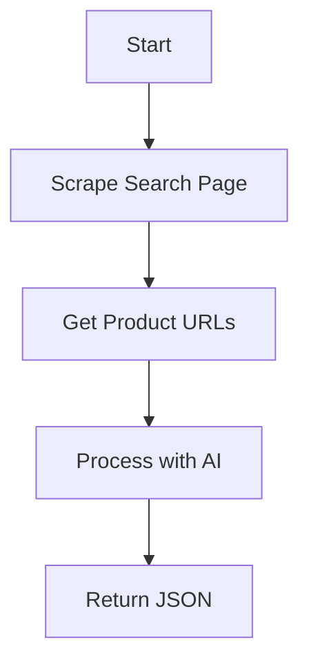

# eBay Product Scraper with AI

A Node.js API that scrapes eBay product listings using Puppeteer and enhances data extraction with Deepseek model AI.

## Features

- 🚀 **AI-Powered Extraction**: Uses Deepseek model to accurately extract product details
- ⚡ **Parallel Scraping**: Processes multiple pages simultaneously
- 📦 **Structured JSON**: Clean, consistent output format
- 🔍 **Pagination Support**: Scrapes across multiple listing pages

## How It Works

1. **Static URL Collection**: Uses Puppeteer to gather product page URLs
2. **AI Data Extraction**: Sends each product page to Deepseek model for processing
3. **Result Aggregation**: Combines data from all pages into a single JSON response



## 📦 Installation

1. **Clone the repository**
   ```bash
   git clone https://github.com/yourusername/ebay-ai-scraper.git
   cd ebay-ai-scraper
   ```
2. Install dependencies
   ```bash
    npm install
   ```
3. Create .env file:
    You can copy it from the .env.example
    or
    Write this in your .env file:
    ``` bash
     OPENROUTER_API_KEY=your_api_key_here
    ```

## Project Structure
    ebay-ai-scraper/
    ├── 
    ├── scraper.js       # Core scraping logic
    ├── deepseek.js      # AI integration
    ├── server.js        # Express API
    ├── screenshots/         # Demo images
    ├── .env.example         # Environment template
    └── package.json
    
## Usage

1. Start the server
    ```bash
    node server.js
    ```
2. Make a request to this URL:
    ```markdown
    URL:
    [http://localhost:3000/scrape](http://localhost:3000/scrape?keyword=nike&maxPages=2)
    ```
3. API Endpoint:
    ```http
    GET /scrape?keyword={query}&maxPages={n}
    ```
4. Sample Response:
  ```json
  [
    {
      "product_name": "Nike Air Max 90 SE Men's Shoes Size 10.5 White Black AH8050-100",
      "product_price": "$129.99",
      "product_description": "Nike Air Max 90 SE Men's Shoes Size 10.5 White Black AH8050-100. Condition is \"New with box\". Shipped with USPS Priority Mail."
    },
    {
      "product_name": "Nike Air Force 1 '07 LV8 Men's Shoes White/Black/White",
      "product_price": "$99.99",
      "product_description": "Brand new in box. Authentic Nike Air Force 1 '07 LV8 Men's Shoes in White/Black/White colorway. Style code: CW2288-100. Includes original box and all accessories."
    },
  ]
  ```

## ⚙️ Configuration

| Parameter     | Default | Description                      |
|---------------|---------|----------------------------------|
| `keyword`     | `nike`  | Search term for eBay             |
| `maxPages`    | `2`     | Number of listing pages to scrape |
| `concurrency` | `2`     | Parallel browser instances       |

---

## 🛠 Technical Stack

| Component          | Purpose                          |
|--------------------|----------------------------------|
| `Puppeteer`        | Headless browser automation      |
| `puppeteer-cluster`| Parallel scraping management     |
| `Deepseek AI`      | Intelligent data extraction      |
| `Express`          | API endpoint handling            |

---

## ❗ Troubleshooting

**Common Issues:**

- **API Limit Errors:**
  - Reduce `maxConcurrency` in `scraper.js`
  - Add delays between requests

- **Missing Data:**
  - Check for updated CSS selectors in eBay’s HTML
  - Verify your `OPENROUTER_API_KEY` is valid
